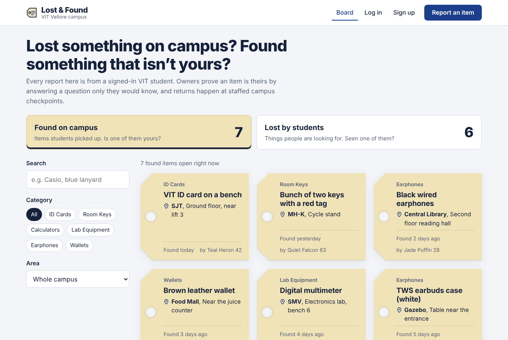
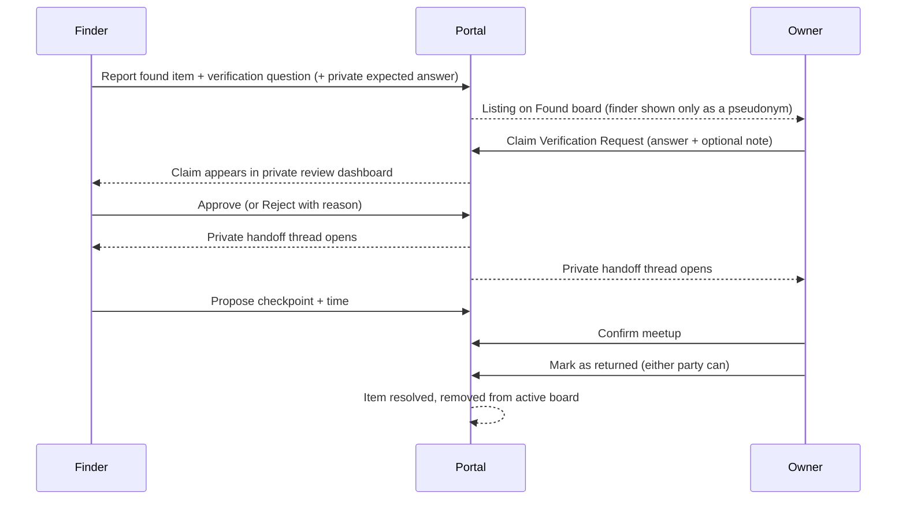
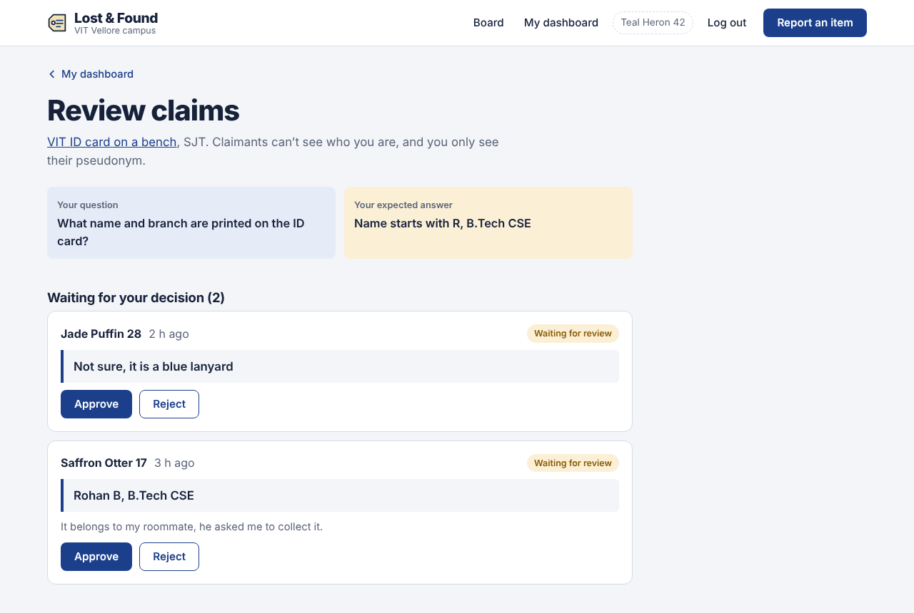
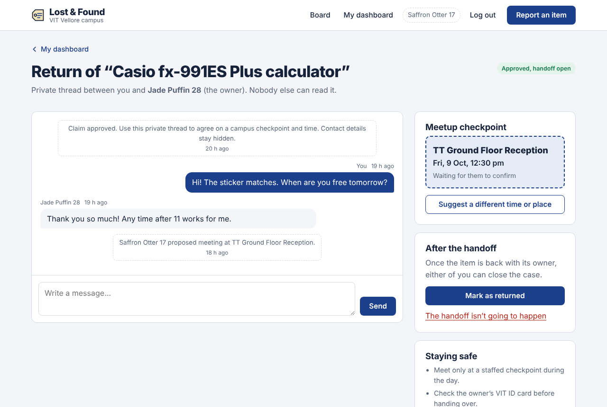

# VIT Campus Lost & Found Recovery Portal

A full-stack web app that replaces the campus WhatsApp groups for lost and found items at VIT Vellore. Students report items against official campus venues, prove ownership by answering a private challenge set by the poster, and arrange returns at staffed campus checkpoints through an in-app thread, without anyone's phone number, email or registration number being exposed.



## Contents

- [Features](#features)
- [Tech stack](#tech-stack)
- [Project structure](#project-structure)
- [Local setup](#local-setup)
  - [Windows: double-click setup](#windows-double-click-setup)
  - [Command line (Windows, macOS, Linux)](#command-line-windows-macos-linux)
- [Database bootstrap scripts](#database-bootstrap-scripts)
- [Running the app](#running-the-app)
- [Demo accounts](#demo-accounts)
- [How the workflow works](#how-the-workflow-works)
- [Privacy design](#privacy-design)
- [Validation, errors and UI states](#validation-errors-and-ui-states)
- [API reference](#api-reference)
- [Tests](#tests)
- [Troubleshooting](#troubleshooting)

## Features

| Requirement | How it's implemented |
| --- | --- |
| Separate Lost and Found feeds | Board with two feeds and live counts. Filter by category, campus area, specific block, and free-text search. Paginated. |
| VIT venue tagging | Venues are a fixed server-side list: Academic Blocks (SJT, TT, PRP, SMV, MB, GDN, CDMM), Men's Hostels MH-A to MH-T, Ladies' Hostels LH-A to LH-J, Food Courts (Gazebo, Food Mall, DC), Central Library and Sports Complex. Any other value is rejected by the API. |
| Category tags | ID Cards, Room Keys, Calculators, Lab Equipment, Earphones, Wallets. |
| Student authentication | Sign-up requires a VIT registration number (e.g. `24BCE2353`) and a `@vitstudent.ac.in` email. Passwords are hashed with bcrypt; sessions use signed JWTs. |
| Masked public listings | Listings show only a random pseudonym (e.g. "Teal Heron 42") plus masked details: `24•••••53`, `n•••••@vitstudent.ac.in`, phone hidden. The raw values never leave the server. |
| Ownership verification | Every post carries a verification question set by the poster. Claimants submit a Claim Verification Request with their answer. The poster can also store a private expected answer, which is shown next to each claim on the private review screen. Claimants never see the finder's identity. |
| Approve / Reject | Poster reviews claims in a private dashboard, approves one or rejects with an optional reason. A student whose claim on an item is rejected twice can't claim it again. |
| Safe in-app handoff | Approval opens a private thread visible only to the two people involved. Either side proposes a meetup at a staffed checkpoint (SJT Ground Floor Reception, Central Library Security Desk, etc.) and a time; the other side confirms. Phone numbers and email addresses typed into any post, claim or message are blocked. |
| Lifecycle management | Either party can mark the item as returned. Resolved items leave the active board automatically; other pending claims are closed. A handoff can be cancelled, which puts the item back on the board. |
| Input validation and feedback | Validation on both client and server, field-level error messages, loading skeletons, empty states, error states with retry, submitted/confirmation panels and toasts. |

## Tech stack

- **Frontend:** React 18, React Router 6, Vite 5, plain CSS (no UI framework)
- **Backend:** Node.js, Express 4, Zod (validation), bcryptjs, jsonwebtoken, Helmet, express-rate-limit
- **Database:** SQLite via [sql.js](https://github.com/sql-js/sql.js) (SQLite compiled to WebAssembly). It's a single file with no database server, and no native modules, so it installs on Windows without Visual Studio or Python build tools.
- **Tests:** Node's built-in test runner (`node:test`)

## Project structure

```
.
├── setup.bat               Windows: install everything and create the database
├── start.bat               Windows: start the app and open the browser
├── reset-data.bat          Windows: wipe data and reload the demo data
├── package.json            Root scripts (setup, dev, db:*, build, start, test)
├── scripts/dev.js          Starts API + web app together (works on Windows)
├── client/                 React app
│   ├── index.html
│   ├── vite.config.js      Proxies /api to the Express server in development
│   └── src/
│       ├── api.js          fetch wrapper with readable errors
│       ├── context/        Auth, campus metadata, toasts
│       ├── components/     Layout, luggage-tag listing card, form controls, states
│       ├── pages/          Board, Item, Report, Login/Register, Dashboard,
│       │                   Review claims, Handoff thread
│       └── styles.css
└── server/                 Express API
    ├── .env.example
    ├── db/schema.sql       Tables, constraints and indexes
    ├── scripts/
    │   ├── init-db.js      Creates the database (optionally from scratch)
    │   └── seed.js         Loads demo students, listings, claims, a handoff
    ├── src/
    │   ├── sqlite.js       SQLite wrapper on sql.js, saves to server/data/
    │   ├── app.js          Express app (middleware, routes, static client)
    │   ├── constants.js    Venues, categories, checkpoints (single source of truth)
    │   ├── privacy.js      Pseudonyms, masking, contact-info detection
    │   ├── validation.js   Zod schemas and error formatting
    │   ├── views.js        Response shapes (what each role is allowed to see)
    │   └── routes/         auth, items, claims, me
    └── test/api.test.js    End-to-end API tests
```

## Local setup

The project runs natively on Windows (no WSL needed), macOS and Linux.

### Prerequisites

- **Node.js 20 or newer.** The LTS version from [nodejs.org](https://nodejs.org) is the safest choice. During installation on Windows, keep the default "Add to PATH" option. Check it with `node -v`.
- Git, to clone the repository (optional if you download the ZIP).

Nothing else is needed: no database server, no Visual Studio Build Tools, no Python. The database is a single file at `server/data/lostfound.db`.

### Windows: double-click setup

1. Open the project folder in File Explorer.
2. Double-click **`setup.bat`**. It checks Node.js, installs the packages for the server and the web app, and creates the database with demo data. This takes a minute or two the first time.
3. Double-click **`start.bat`**. It starts the API and the web app and opens **http://localhost:5173** in your browser.
4. Log in with `24BCE1001` and password `Password123` (see [Demo accounts](#demo-accounts)).

To stop the app, close the `start.bat` window or press `Ctrl+C` in it. To wipe everything and reload the demo data, double-click **`reset-data.bat`**.

If Windows Defender Firewall asks whether Node.js may communicate on networks, you can choose **Cancel**; the app only uses `localhost`.

### Command line (Windows, macOS, Linux)

On Windows, use **Command Prompt** (`cmd`). If you use PowerShell and see "running scripts is disabled on this system", either switch to Command Prompt or type `npm.cmd` instead of `npm`.

```bat
git clone https://github.com/<your-username>/vit-lost-found-portal.git
cd vit-lost-found-portal

npm run setup      :: installs server and web app packages
npm run db:reset   :: creates the database and loads demo data
npm run dev        :: starts the API (port 4000) and the web app (port 5173)
```

Open **http://localhost:5173**. On macOS/Linux the commands are the same (ignore the `::` comments).

### Environment variables (optional)

The app runs with sensible defaults. To change them, copy the example file:

```bat
copy server\.env.example server\.env      :: Windows (Command Prompt)
cp server/.env.example server/.env        # macOS / Linux
```

| Variable | Default | Purpose |
| --- | --- | --- |
| `PORT` | `4000` | API port |
| `JWT_SECRET` | dev-only value | Secret used to sign login tokens. **Required** when `NODE_ENV=production`. |
| `JWT_EXPIRES_IN` | `7d` | Login lifetime |
| `DB_FILE` | `data/lostfound.db` | SQLite file, relative to `server/` |
| `CLIENT_ORIGIN` | `http://localhost:5173` | Allowed CORS origin for the dev client |

## Database bootstrap scripts

All commands can be run from the project root.

| Command | What it does |
| --- | --- |
| `npm run db:init` | Creates `server/data/lostfound.db` and all tables from `server/db/schema.sql`. Safe to run repeatedly; existing data is kept. |
| `npm run db:seed` | Loads 4 demo students, 13 open listings across both feeds, pending/approved/rejected claims, an active handoff thread and one resolved case. Re-running replaces only the demo data. |
| `npm run db:reset` | Deletes the database file, recreates the schema and seeds demo data. |

On Windows, `reset-data.bat` does the same as `npm run db:reset`. You can also run them inside `server/`, or reset without seeding with `node scripts/init-db.js --reset`.

These scripts are safe to run while the app is running: the API notices the database file changed and reloads it before the next request.

The API also applies the schema on start-up, so a fresh clone works even if you skip `db:init`.

### Schema overview

| Table | Purpose |
| --- | --- |
| `users` | Student accounts. `reg_no`, `email`, `phone` are private; `alias` is the public pseudonym. |
| `items` | Lost/found reports with venue, category, date, verification question, optional private expected answer, and status `open`, `in_handoff` or `resolved`. |
| `claims` | Claim Verification Requests: answer, note, status (`pending`, `approved`, `rejected`, `withdrawn`, `cancelled`, `completed`) and the agreed meetup checkpoint/time. Partial unique indexes guarantee one live claim per student per item and only one approved claim per item. |
| `messages` | The private handoff thread, including system notes (approval, meetup proposals, resolution). |

## Running the app

**Development** (hot reload for both client and server):

```bat
npm run dev
```

On Windows you can double-click `start.bat` instead. `npm run dev -- --open` also opens the browser.

- Web app: http://localhost:5173
- API: http://localhost:4000/api (health check: `/api/health`)

**Production-style** (Express serves the built React app on one port):

```bat
npm run build
npm start
```

Then open http://localhost:4000. For a real deployment, set `JWT_SECRET` in `server/.env` and run with `NODE_ENV=production` (Command Prompt: `set "NODE_ENV=production" && npm start`).

## Demo accounts

After `npm run db:seed`, all demo accounts use the password **`Password123`**. You can log in with either the email or the registration number.

| Email | Reg. no. | Shown publicly as | Good for trying |
| --- | --- | --- | --- |
| aarav.menon2024@vitstudent.ac.in | 24BCE1001 | Teal Heron 42 | Reviewing two pending claims on a found ID card |
| diya.sharma2023@vitstudent.ac.in | 23BIT0457 | Saffron Otter 17 | An active handoff as the finder of a calculator |
| fathima.noor2024@vitstudent.ac.in | 24BCE2210 | Jade Puffin 28 | Confirming the proposed meetup as the claimant |
| karthik.raja2022@vitstudent.ac.in | 22BEC0312 | Quiet Falcon 63 | A resolved case and a rejected claim |

A good walkthrough: log in as Aarav, open **My dashboard → Review 2 claims**, compare each answer with the expected answer, approve the correct one, then propose a meetup in the handoff thread. Open a private window, log in as Diya, and confirm it.

## How the workflow works



Lost items use the same flow in reverse: the owner posts the item with a question, someone who found it answers the question, and the owner approves them.




## Privacy design

- **Pseudonyms everywhere.** Each account gets a random alias at sign-up. It's the only identity other students ever see, on listings, in claim reviews and in handoff threads.
- **Server-side masking.** Public responses are built by `views.js` and `privacy.js`, which only ever emit masked registration numbers and emails. The tests assert that raw values never appear in public JSON.
- **Private answers stay private.** The finder's expected answer is only returned to the finder.
- **Role checks on every claim action.** Only the poster can review, approve or reject; only the claimant can withdraw; only those two can read or write the thread.
- **No contact details in free text.** Titles, descriptions, claims and messages are scanned for phone numbers and email addresses and rejected with a clear message, so contact can't leak through a chat either.
- **Rate limiting** on sign-in/sign-up and the API in general to slow down spam.

## Validation, errors and UI states

- **Server:** Zod schemas validate every request body and query string. Errors come back as `{ "error": { "message": "...", "fields": { "fieldName": "..." } } }` with proper status codes (400, 401, 403, 404, 409, 429).
- **Client:** forms validate before submitting and show messages under each field. Server field errors are mapped back onto the same fields.
- **Loading:** skeleton tags on the board, spinners on buttons while requests run.
- **Empty:** every list has an empty state with a next step (report an item, clear filters, browse found items).
- **Error:** network or server failures show what went wrong with a "Try again" button.
- **Submitted:** confirmation panels after posting a report or sending a claim, plus toasts for approvals, rejections, meetups and resolutions.

## API reference

All endpoints are under `/api`. Authenticated endpoints need `Authorization: Bearer <token>`.

| Method | Endpoint | Auth | Description |
| --- | --- | --- | --- |
| GET | `/meta` | | Venue groups, categories and handoff checkpoints |
| POST | `/auth/register` | | Create an account; returns token and profile |
| POST | `/auth/login` | | Log in with email or reg. no. |
| GET | `/auth/me` | ✓ | Your own (unmasked) profile |
| GET | `/items?type=found&category=&group=&venue=&q=&page=` | | Active board listings with counts per feed |
| GET | `/items/:id` | optional | One listing; includes your claim status, or review info if you posted it |
| POST | `/items` | ✓ | Report a lost or found item |
| DELETE | `/items/:id` | poster | Remove a post (not during an active handoff) |
| POST | `/items/:id/resolve` | poster or approved claimant | Mark as returned |
| GET | `/items/:id/claims` | poster | Private claim review list |
| POST | `/items/:id/claims` | ✓ | Submit a Claim Verification Request |
| POST | `/claims/:id/approve` | poster | Approve; opens the handoff thread |
| POST | `/claims/:id/reject` | poster | Reject with optional reason |
| POST | `/claims/:id/withdraw` | claimant | Withdraw a pending claim |
| GET | `/claims/:id` | participants | Handoff thread, meetup and messages |
| POST | `/claims/:id/messages` | participants | Send a message |
| POST | `/claims/:id/meetup` | participants | Propose a checkpoint and time |
| POST | `/claims/:id/meetup/confirm` | the other participant | Confirm the proposed meetup |
| POST | `/claims/:id/cancel` | participants | Cancel the handoff; item returns to the board |
| GET | `/me/items` | ✓ | Your posts with claim counts |
| GET | `/me/claims` | ✓ | Claims you have submitted |

## Tests

```bat
npm test
```

Runs the end-to-end API suite against an in-memory database (your real data isn't touched). It covers registration and login validation, venue validation, masking of contact details on public listings, the full claim, approve, message, meetup and resolve cycle, permission checks for outsiders, contact-info blocking, and error responses.

## Troubleshooting

- **`'node' is not recognized` / `setup.bat` says Node.js is not installed.** Install the LTS version from nodejs.org, then close and reopen Command Prompt (or File Explorer) so the new PATH is picked up.
- **PowerShell: "running scripts is disabled on this system".** Use Command Prompt, the `.bat` files, or `npm.cmd` instead of `npm`.
- **Port already in use** (`EADDRINUSE`). Another copy of the app is probably still running. Close its window, or on Windows find and stop it:
  ```bat
  netstat -ano | findstr :4000
  taskkill /PID <pid-from-last-column> /F
  ```
  You can also change `PORT` in `server/.env` (and the proxy target in `client/vite.config.js`).
- **"Can't reach the server" in the browser.** The API isn't running. Use `start.bat` or `npm run dev` from the project root so both parts start together.
- **`Terminate batch job (Y/N)?` after Ctrl+C.** That's Windows asking to close `start.bat`; type `Y`.
- **Start over with clean data.** `reset-data.bat` or `npm run db:reset`.
- **Logged out unexpectedly.** Tokens expire after 7 days by default; log in again.
- **Folder names with `&` or spaces.** Supported. The npm scripts call Node directly instead of npm's `.cmd` launchers, which break on Windows when a path contains `&`.
